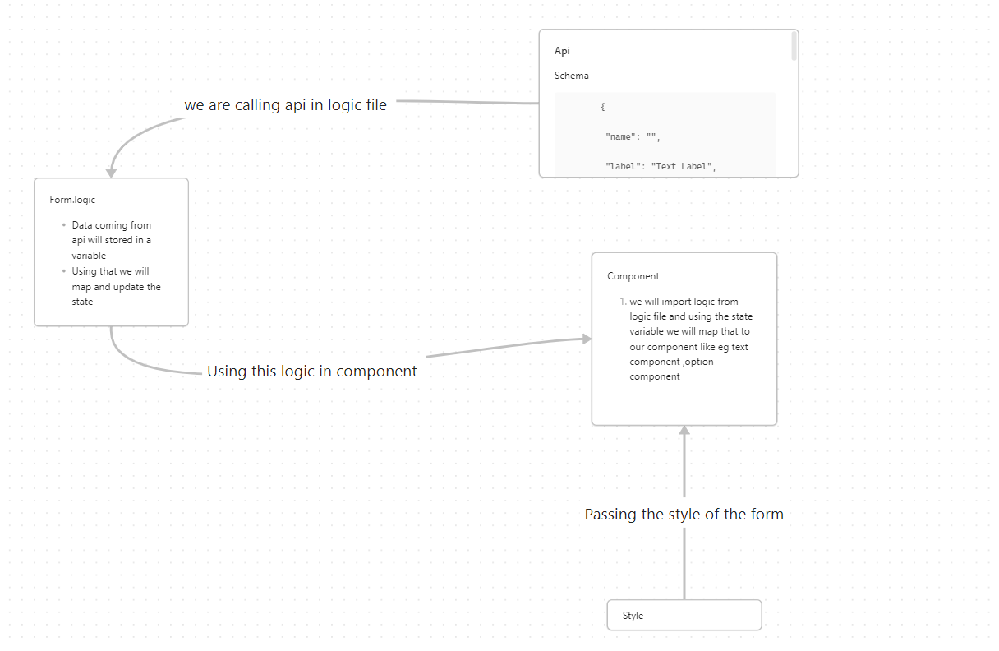

React_Clean_Architecture
React Clean Architecture is an architectural pattern that aims to structure React applications in a clean and organized manner, focusing on separation of concerns, maintainability, and scalability.

npm install --save-dev jest @testing-library/react @testing-library/jest-dom

npm install --save-dev @babel/core @babel/preset-env @babel/preset-react

npm i axios        
npm install -D json-server     
json-server --watch db.json --port 3001    
db.json file    
{
  "users": [
  ]
}

.eslintrc.js
module.exports = {
    env: {
      node: true,
    },
    parserOptions: {
      ecmaVersion: 2021,
      sourceType: 'module',
    },
    rules: {
      // add your custom rules here
    },
  };

  ## workflow :
  step 1: cd React_Clean_Architecture
  step 2: npm i
  step 3: json-server --watch db.json --port 3001

## Project Structure:

├───public
└───src
    ├───api
    ├───assets
    ├───components
    │   ├───generic_components       
    │   │   └───Formfields
    │   │       ├───checkbox
    │   │       ├───date
    │   │       ├───email
    │   │       ├───file
    │   │       ├───inputs
    │   │       ├───modal
    │   │       ├───number
    │   │       ├───options
    │   │       ├───password
    │   │       ├───phone
    │   │       ├───radio_button     
    │   │       ├───text
    │   │       ├───textarea
    │   │       └───time
    │   ├───registrationform
    │   └───userform
    ├───contexts
    ├───layouts
    ├───pages
    │   ├───loan
    │   └───loan_get
    ├───redux
    │   ├───actions
    │   └───reducers
    └───routes

 ##   Code Flow

 